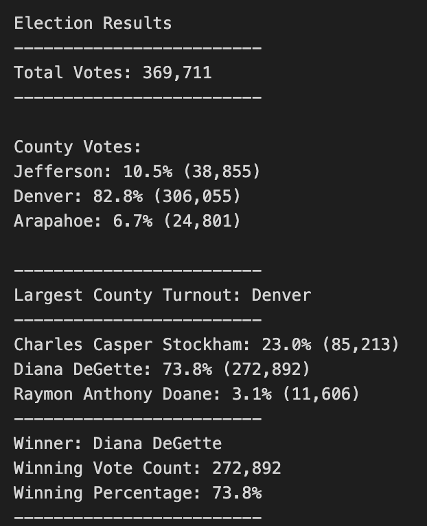

# Election Analysis

## Overview of Election Audit

A Colorado Board of Elections employee has given the following tasks to complete the election audit of a recent local congressional election.

1. Calculate the total number of votes cast.
2. Get the voter turnout for each of the counties who are part of this election
3. Determine the county with the largest voter turnout
4. Calculate the total number of votes and percentage of voates each candidate received.
5. Determine the winner of the election based on popular vote.

## Resources
- Data Source: election_results.csv
- Software: Python 3.9.7, Visual Studio Code 1.65.2

---

## Election-Audit Results

- There were 369,711 votes cast in the election.
- There were 3 counties in the election. Their turnout results were as below:
    - Jefferson had 23.0% of voter turnout with 38,855 number of votes.
    - Denver had 82.8% of voter turnout with 306,055 number of votes.
    - Arapahoe had 6.7% of voter turnout with 24,801 number of votes.
- Denver county had the largest number of votes.
- There were 3 candidates as part of this election. The candidate results were:
    - Charles Casper Stockham received 23.0% of the vote and 85,213 number of votes.
    - Diana DeGette received 73.8% of the vote and 272,892 number of votes.
    - Raymon Anthony Doane received 3.1% of the vote and 11,606 number of votes.
- The winner of the election was:
    - Candidate Diana DeGette who received 73.8% of the vote and 272,892 number of votes.

Detailed View of the Election Audit Results:

---

## Election-Audit Summary

The process built for this analysis without any modification can be used to determine similar results at a county and candidate level. A similar input file with Ballot id, County Name and Candidate Name is required.

On top of this with slight changes in the script and required data this can definitely be enhanced to additional election audits
* If the mapping of counties to higher level classifications like states or districts is provided. The application will be able to define winners for each of the districts from one source itself.
* If the population of each county is provided, additional insight of voter turnout based on population can be derived
* A new grouping can be easily added by introducing an if condition after the required variables are initialized using this code - https://github.com/sanilveeravu/python_wk3/blob/a12826582ff80398aed33cf0020a3932db4ae6f4/PyPoll_Challenge.py#L60-L79

election results vs election analysis
run in submission
updated file path
